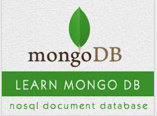

```
Roberto Nogueira  
BSd EE, MSd CE
Solution Integrator Experienced - Certified by Ericsson
```
# TutorialsPoint Mongodb



**About**

Learn everything you need to about the subject of this `Tutorialspoint` project.

[Homepage](https://www.tutorialspoint.com//mongodb/index.htm)

## Topics
```
MongoDB Tutorial
[x] Home
[x] Overview
[x] Advantages
[x] Environment
[x] Data Modeling
[x] Create Database
[x] Drop Database
[x] Create Collection
[x] Drop Collection
[ ] Data Types
[ ] Insert Document
[ ] Query Document
[ ] Update Document
[ ] Delete Document
[ ] Projection
[ ] Limiting Records
[ ] Sorting Records
[ ] Indexing
[ ] Aggregation
[ ] Replication
[ ] Sharding
[ ] Create Backup
[ ] Deployment
[ ] Java
[ ] PHP
Advanced MongoDB
[ ] Relationships
[ ] Database References
[ ] Covered Queries
[ ] Analyzing Queries
[ ] Atomic Operations
[ ] Advanced Indexing
[ ] Indexing Limitations
[ ] ObjectId
[ ] Map Reduce
[ ] Text Search
[ ] Regular Expression
Working with Rockmongo
[ ] GridFS
[ ] Capped Collections
Auto-Increment Sequence
MongoDB Useful Resources
[ ] Questions and Answers
[ ] Quick Guide
[ ] Useful Resources
[ ] Discussion
Selected Reading
[ ] Developer's Best Practices
[ ] Questions and Answers
[ ] Effective Resume Writing
[ ] HR Interview Questions
[ ] Computer Glossary
[ ] Who is Who
```
