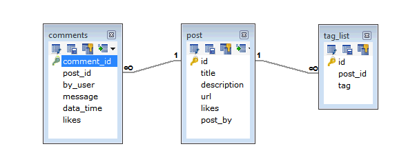

**MongoDB - Data Modelling**

Data in MongoDB has a flexible schema.documents in the same collection. They do not need to have the same set of fields or structure, and common fields in a collection’s documents may hold different types of data.

Some considerations while designing Schema in MongoDB

Design your schema according to user requirements.

Combine objects into one document if you will use them together. Otherwise separate them (but make sure there should not be need of joins).

Duplicate the data (but limited) because disk space is cheap as compare to compute time.

Do joins while write, not on read.

Optimize your schema for most frequent use cases.

Do complex aggregation in the schema.

**Example**
Suppose a client needs a database design for his blog/website and see the differences between RDBMS and MongoDB schema design. Website has the following requirements.

Every post has the unique title, description and url.
Every post can have one or more tags.
Every post has the name of its publisher and total number of likes.
Every post has comments given by users along with their name, message, data-time and likes.
On each post, there can be zero or more comments.
In RDBMS schema, design for above requirements will have minimum three tables.



RDBMS Schema Design
While in MongoDB schema, design will have one collection post and the following structure -
```javascript

{
   _id: POST_ID
   title: TITLE_OF_POST, 
   description: POST_DESCRIPTION,
   by: POST_BY,
   url: URL_OF_POST,
   tags: [TAG1, TAG2, TAG3],
   likes: TOTAL_LIKES, 
   comments: [	
      {
         user:'COMMENT_BY',
         message: TEXT,
         dateCreated: DATE_TIME,
         like: LIKES 
      },
      {
         user:'COMMENT_BY',
         message: TEXT,
         dateCreated: DATE_TIME,
         like: LIKES
      }
   ]
}
```

So while showing the data, in RDBMS you need to join three tables and in MongoDB, data will be shown from one collection only.